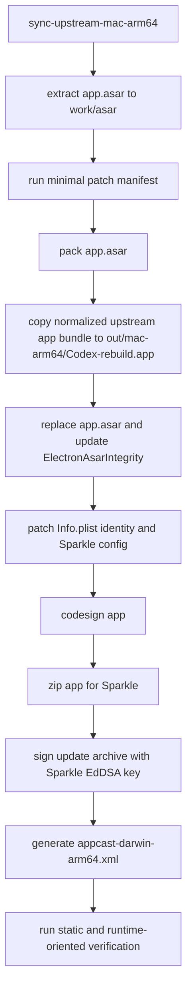

# Codex Rebuild 个人可用版设计文档

## 设计目标

本项目构建 macOS arm64 个人可用版 `Codex-rebuild.app`。系统从官方 Codex macOS arm64 包同步资源，在解包后的 ASAR 内容上执行最小必要 patch，重新打包并更新 ASAR integrity，再修改 app 身份、更新通道和签名，最后生成可由 Sparkle 更新的 zip 产物和 `appcast-darwin-arm64.xml`。

设计原则：

- 当前阶段只支持 macOS arm64。
- 只实现需求文档列出的 patch。
- 保留 app 内更新器，将更新源切换到本项目 feed。
- 默认 ad-hoc codesign，允许本机自签证书。
- 不引入 `@cometix/codex`，保留官方 CLI 和官方资源。

## 总体架构



## 目录结构

项目根目录以仓库 checkout 目录为准，文档和脚本统一使用相对路径描述。

```text
doc/
  requirements.md
  design.md
  plan.md
  reviews/
config/
  sparkle/
    public-ed-key.txt
scripts/
  sync-upstream-mac.js
  patch-all-minimal.js
  patch-util.js
  patch-copyright.js
  patch-fast-mode.js
  patch-plugin-capabilities.js
  patch-update-channel.js
  build-mac-arm64.js
  generate-appcast.js
  verify-build.js
src/
  mac-arm64/
    _asar/
    app.asar.unpacked/
    resources copied from upstream
    upstream/
      Codex.app
      Codex-arm64.zip
      checksums.json
    upstream-metadata.json
out/
  mac-arm64/
    Codex-rebuild.app
  release/
    Codex-rebuild-darwin-arm64-<shortVersion>-<buildNumber>.zip
    appcast-darwin-arm64.xml
```

`src/` 和 `out/` 是生成目录，默认加入 `.gitignore`。`config/sparkle/public-ed-key.txt` 是可提交配置。Sparkle private key 只通过环境变量或本机未跟踪文件输入。

## 模块设计

### 1. 上游同步模块

脚本：`scripts/sync-upstream-mac.js`

职责：

- 下载官方 macOS arm64 appcast：`https://persistent.oaistatic.com/codex-app-prod/appcast.xml`
- 解析最新 item，取得上游版本、build、最低系统版本、下载 URL。
- 下载官方 zip 到缓存目录。
- 使用 `ditto -xk` 解压，保留 macOS bundle 结构。
- 定位唯一一个 `Contents/Resources/app.asar` 为普通文件的外层 `.app`；遇到 `.app` 后停止向内递归，避免把 helper app 当成主 app。
- `Contents`、`Resources`、`MacOS`、`Info.plist`、`app.asar` 和主可执行文件的路径组件不得包含符号链接，realpath 必须保持在候选 app 内。
- 从主 app 的 `Info.plist` 读取 `CFBundleExecutable`，确认其为 basename，且对应 `Contents/MacOS/<CFBundleExecutable>` 为可执行的普通文件。
- 提取 `app.asar` 到 `src/mac-arm64/_asar`。
- 复制 `app.asar.unpacked` 和除 `app.asar` 外的必要资源到 `src/mac-arm64/`。
- 将发现的主 app 规范化复制到稳定内部路径 `src/mac-arm64/upstream/Codex.app`；该路径不代表上游 bundle 的原始名称。

输出：

- `src/mac-arm64/_asar`
- `src/mac-arm64/app.asar.unpacked`
- `src/mac-arm64/upstream/Codex.app`
- `src/mac-arm64/upstream/Codex-arm64.zip`
- `src/mac-arm64/upstream/checksums.json`
- `src/mac-arm64/upstream-metadata.json`

`upstream-metadata.json` 字段：

```json
{
  "platform": "mac-arm64",
  "upstreamVersion": "26.623.101652",
  "upstreamBuild": "1272",
  "upstreamExecutable": "ChatGPT",
  "minimumSystemVersion": "14.0",
  "downloadUrl": "https://example.invalid/Codex.zip",
  "archivePath": "src/mac-arm64/upstream/Codex-arm64.zip",
  "appPath": "src/mac-arm64/upstream/Codex.app",
  "archiveSha256": "sha256-hex",
  "appAsarSha256": "sha256-hex"
}
```

失败策略：

- appcast 拉取失败、下载失败、找不到唯一主 app、主可执行文件无效、ASAR 解包失败时立即退出非零。
- 不做静默降级到本地旧缓存；缓存只用于减少重复下载，必须能校验当前目标版本。
- 打包阶段只能复制 `upstream-metadata.json` 指向的 `appPath`，并必须重新校验 `archiveSha256` 或 `appAsarSha256`，以及 `upstreamExecutable` 与源 app、输出 app 的可执行文件契约。

### 2. Patch 编排模块

脚本：`scripts/patch-all-minimal.js`

职责：

- 严格按 manifest 执行当前需求允许的 patch：
  - `patch-copyright.js`
  - `patch-fast-mode.js`
  - `patch-plugin-capabilities.js`
  - `patch-update-channel.js`
- 支持 `--check` dry-run。
- 每个 patch 输出命中文件、规则名、替换数量。
- 任一必需 patch 无匹配时失败。

不包含：

- i18n patch
- DevTools patch
- archive delete patch
- updater disable patch
- sunset patch
- GPU patch
- CLI 替换

### 3. About 版权 patch

脚本：`scripts/patch-copyright.js`

参考 `CodexDesktop-Rebuild/scripts/patch-copyright.js` 的 AST 思路。扫描 ASAR 解包后的 `.vite/build/main*.js`，查找 About 面板 `copyright` 属性，匹配旧值 `© OpenAI` 后替换为：

```text
© OpenAI · itstarts Rebuild
```

规则：

- 只允许替换 About 面板 `copyright` 属性值。
- 支持 string literal 和无表达式 template literal。
- 若已存在目标文案，视为已 patch。
- 若既没有旧值也没有目标文案，失败。

### 4. Fast mode patch

脚本：`scripts/patch-fast-mode.js`

功能拆成两类规则：

1. UI/权限门控
   - 扫描 `webview/assets/*.js`。
   - 找到同时包含 `authMethod` 和 `fast_mode` 的函数。
   - 将函数内 `X.authMethod !== "chatgpt"` 结构替换为 `!1`。

2. 请求 tier 传递
   - 对已人工复核的上游版本/build，先校验原始 `app.asar` SHA-256，并校验五个关键角色对应的一至多个模块在原始 ASAR、解包工作树和版本清单中的字节哈希完全一致。同一物理模块可以承担多个角色，但共享路径必须声明相同 SHA-256。
   - 在哈希校验通过后，使用 AST 验证 Fast=`priority`、Standard=官方默认行为、UI setter、请求 resolver，以及 `start-conversation` 和 `start-turn-for-host` 两条请求链路。
   - 已登记版本/build 如果出现未知 ASAR 哈希、模块哈希或结构变化，必须失败且不得回退到旧扫描逻辑。
   - 未登记的上游版本保留旧的结构化扫描兼容路径；若只能找到 UI gate，找不到请求 payload 构造点或原生 tier 证据，patch 必须失败。
   - 通过版本绑定校验的请求层保持上游原生逻辑，且请求文本 patch 命中数必须为零。

验证策略：

- 静态 dry-run 输出两类规则的匹配。
- 对版本绑定校验输出上游版本/build、原始 ASAR 哈希、五个角色在一个或多个模块中的清单/ASAR/工作树哈希，以及两条请求 action 的 AST 证据。
- 运行时可观察请求验证使用本地代理或 mock endpoint 捕获请求 payload，分别触发 Fast 和 Standard，确认 tier 不同。
- 请求验证必须保存两条证据：`fast-request.json` 和 `standard-request.json`，其中 tier 字段分别可解析为 `fast` 或上游 Fast 等价值，以及 `standard` 或上游 Standard 等价值；当前上游 Fast 等价值为 `priority`。
- 若上游字段从 `service_tier` 改名，patch 必须失败并提示人工复核。

### 5. 插件和能力 patch

脚本：`scripts/patch-plugin-capabilities.js`

参考 `CodexDesktop-Rebuild/scripts/patch-plugin-auth.js`，但拆成显式规则，便于审计和开关：

- `plugin_auth_gate`：将只用于插件 auth 的 `chatgpt` 非等判断改为允许。
- `browser_computer_availability`：将 browser use、computer use availability object 中的 `allowed`、`available` 改为 true。
- `statsig_capability_gate`：在包含 `browser_use`、`browser_use_external`、`computer_use` 的函数上下文内，将数字 Statsig gate 调用改为 true。
- `goal_gate`：在 composer 相关 chunk 中保留 `mode !== "cloud"`，绕过 `/goal` 对 Statsig/config 的本地门控。
- `feature_defaults`：将 browser/computer 直接依赖的默认 feature values 改为 true，包括 `browserPane`、`inAppBrowserUse`、`inAppBrowserUseAllowed`、`externalBrowserUse`、`externalBrowserUseAllowed`、`computerUse`、`computerUseNodeRepl`、`control`、`multiWindow`、`features.js_repl`。
- `bundled_plugin_filter`：绕过 bundled plugin descriptor 中依赖 feature availability 的 `isAvailable` 过滤，使相关插件被纳入。
- `browser_peer_authorization`：在 ad-hoc 或自签签名下绕过 browser-use native peer authorization 对 OpenAI Team ID 的硬编码检查。

边界：

- 不修改 i18n、DevTools、archive delete、sunset、GPU、updater disable 逻辑。
- 不保证服务端或账号权限支持。
- 每条规则都必须独立统计替换数量。
- `bundled_plugin_filter` 只能作用于 descriptor 列表中 plugin id 或 feature key 包含 `browser_use`、`browser_use_external`、`computer_use`、`control`、`js_repl` 的条目。
- 如果上游 filter callback 无法在 AST 中关联到上述 plugin id 或 feature key，不能使用全局 `()=>!0` 替换，必须失败并提示人工复核。

### 6. 更新通道 patch

脚本：`scripts/patch-update-channel.js`

职责：

- 修改 ASAR 内 `package.json` 中的运行时更新配置，使 app 使用本项目 feed 和 public key。
- 修改字段至少包括：
  - `codexSparkleFeedUrl`
  - `codexSparklePublicKey`
- 如果上游新增或改名为等价字段，必须在 patch 配置中显式登记，不能只改仓库根目录 `package.json`。

项目 feed URL：

```text
https://github.com/itstarts/codex-app-rebuild/releases/latest/download/appcast-darwin-arm64.xml
```

- 修改 `Info.plist` 中 Sparkle 相关字段：
  - `SUFeedURL`
  - `SUPublicEDKey`
- `SUPublicEDKey` 从 `config/sparkle/public-ed-key.txt` 读取。
- 确认 `shouldIncludeSparkle` 和 `shouldIncludeUpdater` 没有被替换成固定 false。
- 验证 `Contents/Frameworks/Sparkle.framework` 或上游等价 Sparkle resource 存在。
- 在 ASAR 中通过同一顶层 container 的两个 predicate、精确 CommonJS getter 和同一 consumer 的双调用链，唯一定位主进程 updater 模块；未消费的 worker 副本不作为候选。
- updater definition、build-flavor 和主进程 consumer 三个模块必须同时命中同一组已人工复核的源文件 SHA-256；任一字节变化都必须失败并触发重新评审，不能仅凭局部 AST 或方法名调用继续放行。
- 对 updater 模块实际 require 的 build-flavor chunk 验证 `As` 或 `qs` getter，要求最终来源为 `Dev/Agent/Nightly/InternalAlpha/PublicBeta/Prod` 六项精确值。
- 静态求值只接受单条 return 的纯 helper，并拒绝宽松相等、参与求值的 binding、container、consumer alias 或 build-flavor namespace 被重赋值、删除、成员改写或通过别名逃逸。
- `require`、`module.require`、`Object`、`exports`、`process` 等宿主绑定必须保持可信；updater 模块不得加载 CommonJS loader 改写加载路径，`process.env` 及其别名只允许只读使用。
- 用当前产物元数据求值两个 predicate，证明 macOS arm64 prod 构建会包含 Sparkle；未知导出、动态 require、shadowing、歧义或结构变化均立即失败。

失败策略：

- public key 文件不存在或为空时失败。
- 找不到可 patch 的 feed 字段时失败。
- 检测到 updater disable patch 结果时失败。
- updater CommonJS 导出/消费链、build-flavor 真实导出或纯求值证明不唯一、不完整时失败。
- Info.plist 与 ASAR package 更新配置不一致时失败。

### 7. app 身份和打包模块

脚本：`scripts/build-mac-arm64.js`

职责：

- 复制 `upstream-metadata.json` 指向的规范化上游 app 到 `out/mac-arm64/Codex-rebuild.app`。
- 将 patched `_asar` pack 为新的 `app.asar`。
- 替换 `Codex-rebuild.app/Contents/Resources/app.asar`。
- 更新 `Info.plist` 的 `ElectronAsarIntegrity.Resources/app.asar.hash` 和 algorithm。
- 修改主 app `Info.plist`：
  - `CFBundleIdentifier=io.github.itstarts.codex-rebuild`
  - `CFBundleName=Codex-rebuild`
  - `CFBundleDisplayName=Codex-rebuild`
  - `CFBundleShortVersionString=<upstream version>`
  - `CFBundleVersion=<REBUILD_BUILD_NUMBER>`
  - `SUFeedURL=<project feed URL>`
  - `SUPublicEDKey=<project public key>`
- 保留 `CFBundleExecutable=<upstreamExecutable>` 和对应 `Contents/MacOS/<upstreamExecutable>`，并在签名前验证其为可执行的普通文件。
- 修改 helper app bundle id 到 `io.github.itstarts.codex-rebuild` 命名空间。
- helper bundle id 使用确定性映射：
  - `com.openai.codex.helper` -> `io.github.itstarts.codex-rebuild.helper`
  - `com.openai.codex.helper.GPU` -> `io.github.itstarts.codex-rebuild.helper.GPU`
  - `com.openai.codex.helper.Plugin` -> `io.github.itstarts.codex-rebuild.helper.Plugin`
  - `com.openai.codex.helper.Renderer` -> `io.github.itstarts.codex-rebuild.helper.Renderer`
  - 未知 helper id 使用 `io.github.itstarts.codex-rebuild.helper.<original suffix>`，并要求最终 helper id 全局唯一。
- 移除原签名。
- 执行 ad-hoc 或自签 codesign。
- 创建 Sparkle zip。

签名策略：

- 默认命令：`codesign --sign - --force --deep out/mac-arm64/Codex-rebuild.app`
- 指定环境变量 `CODESIGN_IDENTITY` 时使用该身份签名。
- 签名后必须运行 `codesign --verify --deep --strict`。

### 8. 版本号策略

构建号变量：`REBUILD_BUILD_NUMBER`

格式：

```text
YYYYMMDDHHMMSSNN
```

规则：

- 使用 UTC 时间。
- `NN` 是同一秒内两位递增序号。
- 普通构建使用 `NN=00`。
- 候选构建号必须按数值比较大于已发布最大构建号。
- 已发布最大构建号来源优先级：
  1. 当前发布 feed 中最大的 `sparkle:version`
  2. GitHub Releases 中已发布 appcast 的最大 `sparkle:version`
  3. 人工传入的 `REBUILD_PREVIOUS_MAX_BUILD_NUMBER`

可执行策略：

- 当前发布 feed 使用 `REBUILD_FEED_URL` 下载；默认值为项目 feed URL。
- GitHub Releases 使用 GitHub REST API 枚举 `itstarts/codex-app-rebuild` 最近 30 个非 draft release，下载其中名称匹配 `appcast-darwin-arm64.xml` 的资产并解析 `sparkle:version`。
- 人工传入值必须匹配 `^\d{16}$`。
- 三类来源中可用值取数值最大值，而不是第一个可用值。
- 读取顺序仍按需求中的来源优先级执行；最终取最大值是有意的保守策略，用于避免任一来源滞后造成版本回退。
- 网络读取 feed 或 Releases 失败时，如果没有人工传入最大值，发布构建失败；本地开发构建可通过 `--allow-no-previous-release` 跳过发布递增检查。
- 比较使用 BigInt 或固定 16 位十进制字符串字典序；拒绝 Number 浮点比较。

检查：

- 候选值等于已发布最大值时失败。
- 候选值小于已发布最大值时失败。
- `...01` 后的 `...02` 必须通过。
- `...01` 后下一秒的 `...00` 必须通过。

### 9. Appcast 生成模块

脚本：`scripts/generate-appcast.js`

输入：

- release zip 路径
- 上游版本
- `REBUILD_BUILD_NUMBER`
- 更新包 URL
- Sparkle private key
- 上游最低系统版本

输出：

- `out/release/appcast-darwin-arm64.xml`

生成内容：

- `sparkle:version=<REBUILD_BUILD_NUMBER>`
- `sparkle:shortVersionString=<upstream version>`
- `length=<zip size>`
- `sparkle:edSignature=<Sparkle EdDSA signature>`
- `sparkle:minimumSystemVersion=<upstream minimumSystemVersion when present>`
- `sparkle:hardwareRequirements` 约束 arm64 可用硬件

密钥策略：

- Sparkle public key 文件提交到仓库。
- Sparkle private key 通过环境变量 `SPARKLE_PRIVATE_KEY` 或本机未跟踪文件路径 `SPARKLE_PRIVATE_KEY_FILE` 输入。
- 生成脚本不得打印 private key。
- 发布前必须从 private key 推导 public key，并与 `config/sparkle/public-ed-key.txt` 完全一致；不一致时失败。

### 10. 验证模块

脚本：`scripts/verify-build.js`

静态验证：

- `out/mac-arm64/Codex-rebuild.app` 存在。
- `CFBundleIdentifier`、`CFBundleName`、`CFBundleDisplayName` 符合需求。
- `CFBundleExecutable` 等于同步元数据中的 `upstreamExecutable`，且对应 `Contents/MacOS/<upstreamExecutable>` 为可执行的普通文件。
- helper app bundle id 均位于 `io.github.itstarts.codex-rebuild` 命名空间。
- helper app bundle id 符合确定性映射且无重复。
- `SUFeedURL` 指向项目 feed。
- `SUPublicEDKey` 等于 `config/sparkle/public-ed-key.txt`。
- ASAR 内 `package.json` 的 `codexSparkleFeedUrl` 和 `codexSparklePublicKey` 分别等于项目 feed 和 public key。
- `CFBundleShortVersionString` 等于上游版本。
- `CFBundleVersion` 等于 `REBUILD_BUILD_NUMBER`。
- ASAR integrity hash 等于当前 `app.asar` header hash。算法固定为：读取 ASAR 文件 offset 12 的 UInt32LE header size，取 offset 16 起相同长度的 header bytes，计算 SHA-256 hex。
- About 文案存在。
- updater 未被禁用，且 Sparkle framework/resource 存在。
- updater inclusion predicate 在 mac-arm64 prod 元数据下会包含 Sparkle。
- `codesign --verify --deep --strict` 通过。
- appcast 包含 URL、length、版本、短版本、EdDSA 签名和 arm64 硬件要求。
- 构建号正向和负向比较用例通过。

运行时导向验证：

- 启动 app 能打开主窗口。
- Fast 和 Standard 分别触发一条可观察请求，payload tier 符合需求。
- 旧构建读取新 appcast 时能发现更新。
- 旧构建点击内部更新入口后能下载更新包，并通过 Sparkle EdDSA 验签。
- 用户完成系统权限确认或密码输入后，旧构建被替换为新构建。
- 更新完成后验证新 app 的 bundle id、app 名、feed URL、public key、`CFBundleVersion` 和 About 文案仍符合本设计。

运行时导向验证可以人工执行，但脚本必须输出明确步骤和预期结果。

## 与 CodexDesktop-Rebuild 的差异

保留借鉴：

- 官方 appcast 同步方式。
- ASAR extract/pack 流程。
- AST/结构化 patch 思路。
- macOS `ElectronAsarIntegrity` hash 更新。
- ad-hoc codesign 基本流程。

明确不照搬：

- 不执行 `patch-updater.js`。
- 不替换 CLI 为 `@cometix/codex`。
- 不开启 DevTools。
- 不 patch i18n。
- 不加入 archive delete。
- 不调整 Electron fuses。
- 不做 Windows/Linux 构建。

## 安全和密钥边界

- Sparkle private key、证书私钥、Apple 账号、GitHub token 都不得提交。
- CI 或本机发布时通过 secret/environment 注入私钥。
- 日志只能输出 public key 指纹、签名长度和文件路径，不能输出 private key。
- ad-hoc 签名产物只承诺个人可用；Gatekeeper、Keychain、quarantine 提示属于已知限制。

## 错误处理

- 同步、patch、打包、签名、appcast、验证任一阶段失败，整体构建失败。
- patch 找不到目标时失败，避免生成半 patch 产物。
- 版本号不递增时失败。
- public key 缺失或 private key 缺失时发布失败。
- updater 被禁用时验证失败。

## 后续扩展

- macOS x64 支持需要新增 x64 专用 feed 和 appcast 硬件约束。
- universal app 支持需要重新设计产物组合、签名和 Sparkle 条目。
- Developer ID 和 notarization 支持可以作为可选签名策略加入。
